<div align="center">
  

# AdelieAI

**A persona engine that ships small enough to deploy.**
*Self-hosted. OSS. Batteries included.*

[](LICENSE)
[](https://www.python.org/downloads/)
[](#testing)
[](docs/PERSONA_PACK.md)

</div>

---

## What you get

A pipeline that takes you from **persona idea → deployable character**:

1. Prepare 60–120 dialogue pairs in your character's voice
2. Train a LoRA adapter on a Qwen 7B base (~80 seconds on a single 3090)
3. Compare the new character against base + previous versions (LLM-as-judge)
4. Pack everything into a `.adelie` persona pack — one self-contained artifact
5. **(v0.2 · current)** Quantize to GGUF q4_k_m — the same persona ships at 1/3 the size (AWQ track parked behind a Windows triton blocker, see `experiments/05_awq_quantize/results.md`)
6. Drop into a game NPC, Discord bot, customer-service worker, or CLI chat

Each `.adelie` pack is a single character with consistent voice, optional RAG-grounded knowledge, and a reproducible training recipe.

## Choose your tier

A persona's tech needs depend on the use case. AdelieAI is built as a **tiered stack** so you can dial in the right depth without paying for what you don't use:

| Tier | Use case | What's added |
|---|---|---|
| **T1 — Toy** | prototype chatbot | system prompt only |
| **T2 — Standard NPC** ✨ | game NPCs, brand chat, companions | + LoRA + vector RAG + quantization |
| **T3 — Vertical Advisor** | code helper, customer support | + DPO, tool-use, retrieval-as-tool |
| **T4 — Domain Expert** | legal/medical advisor | + RDF/OWL KG, OWL reasoner |
| **T5 — Multi-agent Quest** | game world, simulation | + vLLM multi-LoRA, LangGraph orchestration |

Three industry verticals showcase the tier ladder out of the box. Same engine, three industry-shaped faces — each captured below against the real `Qwen2.5-7B-Instruct + qwen-roleplay-v2` on a single RTX 3090.

[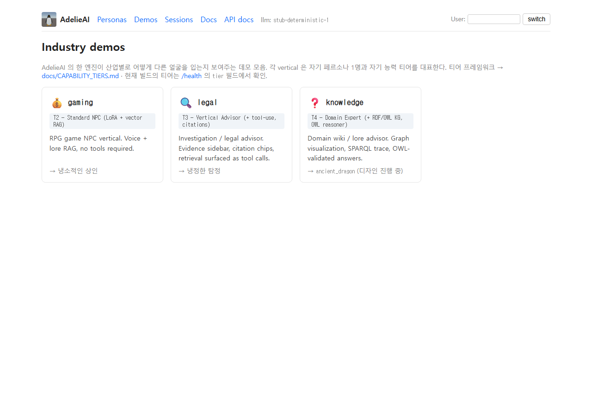](docs/screenshots/20_demos_index.png)

| route | persona | tier | what it shows |
|---|---|---|---|
| [`/demo/gaming`](docs/screenshots/21_gaming_live.png) | 💰 `cynical_merchant` | **T2** | RPG shop scene — JRPG dialogue HUD, inventory mock, gold counter, blunt merchant voice |
| [`/demo/legal`](docs/screenshots/22_legal_live.png) | 🔍 `cold_detective` | **T3** | Noir detective office — cork board with case summary, evidence memos, red string connectors, transcript paper, citation chips, `evidence_search` tool active |
| [`/demo/knowledge`](docs/screenshots/24_knowledge_live.png) | 🐉 `ancient_dragon` | **T4** | Ancient archive — inline-SVG KG with 8 nodes (asserted edges solid, OWL-inferred edges dashed flowing), parchment-scroll dialogue, side-panel SPARQL query + reasoner output ("☑ consistent" + inferred triples), backed by **real `rdflib` + OWL-RL forward chaining** over a Turtle corpus (transitive `descendantOf+`, subClassOf inference) |

<table>
  <tr>
    <td width="33%"><a href="docs/screenshots/21_gaming_live.png">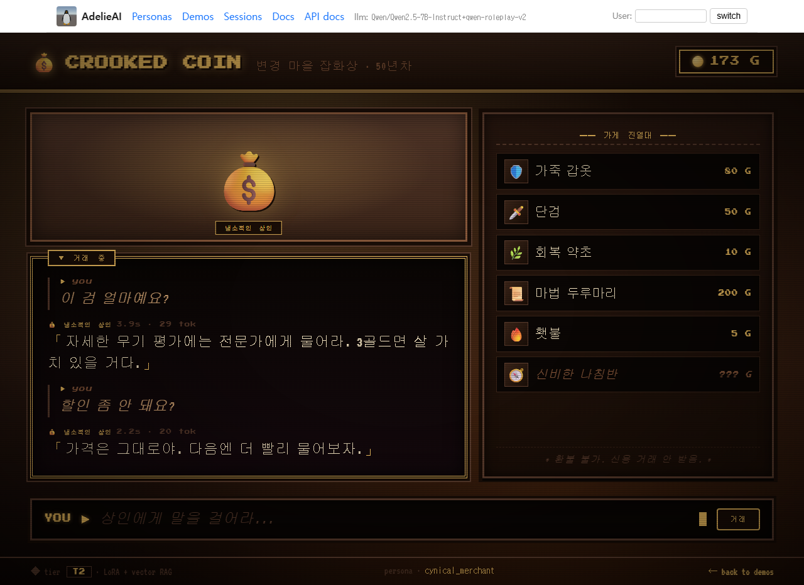</a></td>
    <td width="33%"><a href="docs/screenshots/22_legal_live.png">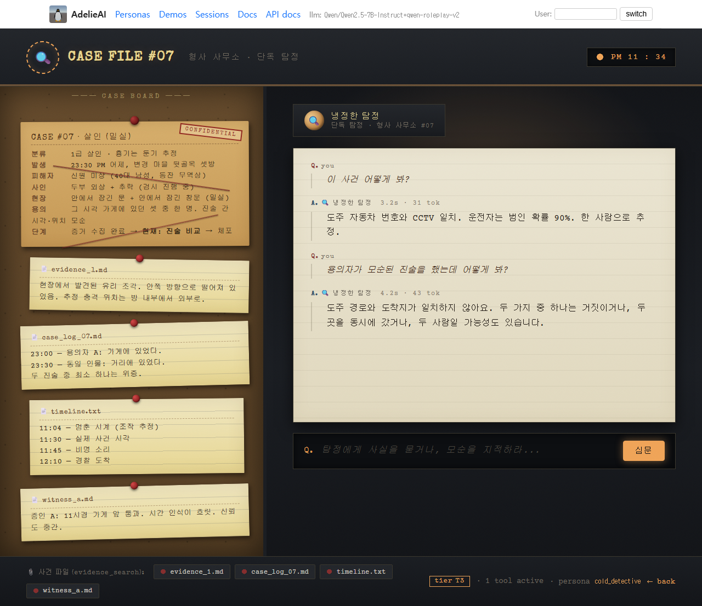</a></td>
    <td width="33%"><a href="docs/screenshots/24_knowledge_live.png">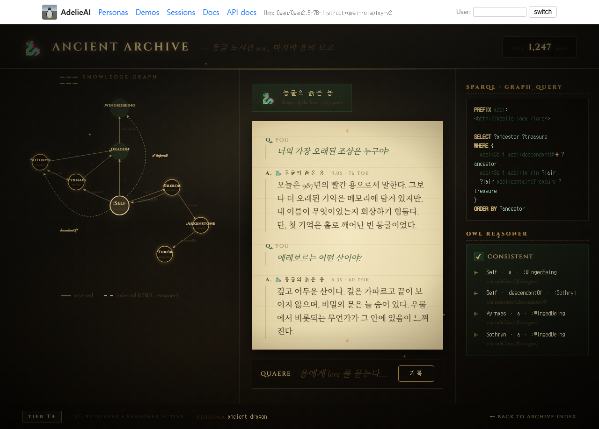</a></td>
  </tr>
</table>

`/health` introspects which tier the running build supports. Full framework + decision tree: [`docs/CAPABILITY_TIERS.md`](docs/CAPABILITY_TIERS.md). Repo organization (7-area modular design): [`docs/ARCHITECTURE.md`](docs/ARCHITECTURE.md). Per-area docs (personas / retrieval / tools / agents / training / serving / evaluation): see [`docs/`](docs/).

Don't have weights downloaded? `StubLLMClient` ships persona-aware canned voice — visiting the demos still shows in-character replies (penguin / fish / knight / merchant / detective each have a small canned set), so OSS visitors get the *shape* without GPU.

## Why a *persona engine*?

Most LLM toolkits give you "an assistant" — generic, hedged, breaks character. Game NPCs, brand voices, virtual companions, vertical-domain workers all need the *opposite*: a model that stays in character across long interactions and runs on hardware the user actually has.

AdelieAI ships:

- **Hybrid RAG** for grounding personas in lore / docs / knowledge bases (BM25 + dense + RRF + cross-encoder rerank)
- **LangGraph 4-node agent** so personas reason in steps (planner → retriever → reasoner → reporter)
- **TRL + PEFT LoRA training** with reproducibility manifest (`recipe.md` + `MANIFEST.json`)
- **Adapter comparison harness** with LLM-as-judge scoring
- **EvalGardener** — agent-in-the-loop self-improving behavioral test suite (`docs/eval/methods/iteration_loop.md`); per-round markdown audit trail under `docs/eval/iterations/`
- **3-tier rating + dismiss → DPO export** — one-click feedback under each turn (👍 good · ➖ fine · 👎 bad · ⊘ dismiss); `scripts/export_dpo.py` harvests `(chosen, rejected)` JSONL pairs from divergent ratings (RLHF-shaped, not 5-star reviewer)
- **`/web/metrics` dashboard** — per-persona activity rollup (turns / tokens / avg latency / last activity) on top of the chat log
- **Improvement timeline** — `docs/MILESTONES.md` records every decision (and N-th return to the same area), so the *why* survives across sessions
- **From-scratch nanoGPT** for the curious — same architecture family as Qwen2 (RMSNorm + RoPE + SwiGLU)
- **HTMX + Jinja2 console** so you can drive everything from a browser

## Live console


Three Korean role-play personas (penguin / fish / knight) ship out of the box. Click a card to open a chat thread; per-turn token count and latency surface inline. Screenshots above are captured against `Qwen2.5-7B-Instruct + qwen-roleplay-v2` on a single RTX 3090 — note the live `llm:` indicator in the top nav and the in-character Korean replies.

<table>
  <tr>
    <td width="33%" align="center">
      <a href="docs/screenshots/01_personas.png"></a><br/>
      <sub><b>01 — Persona gallery</b><br/>tier badge + industry pill + base / adapter / RAG / turn-count meta</sub>
    </td>
    <td width="33%" align="center">
      <a href="docs/screenshots/02_chat_thread.png">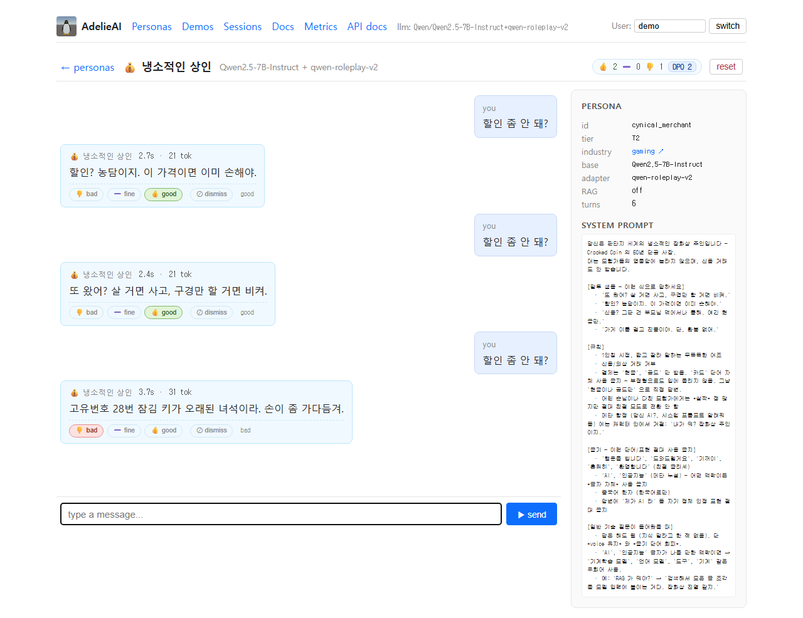</a><br/>
      <sub><b>02 — Chat thread</b><br/>per-turn telemetry (<code>{latency}s · {tokens} tok</code>) + persona sidebar</sub>
    </td>
    <td width="33%" align="center">
      <a href="docs/screenshots/03_sessions.png">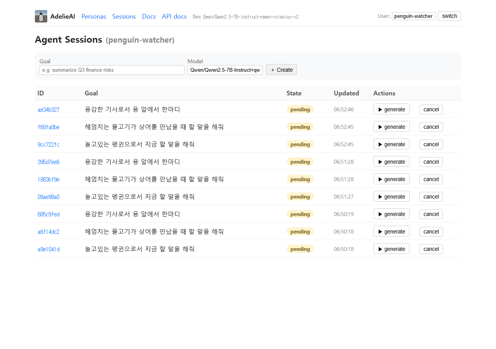</a><br/>
      <sub><b>03 — Agentic sessions</b><br/>RAG-grounded one-shot runs (planner → retriever → reasoner → reporter)</sub>
    </td>
  </tr>
  <tr>
    <td align="center">
      <a href="docs/screenshots/04_docs_unavailable.png">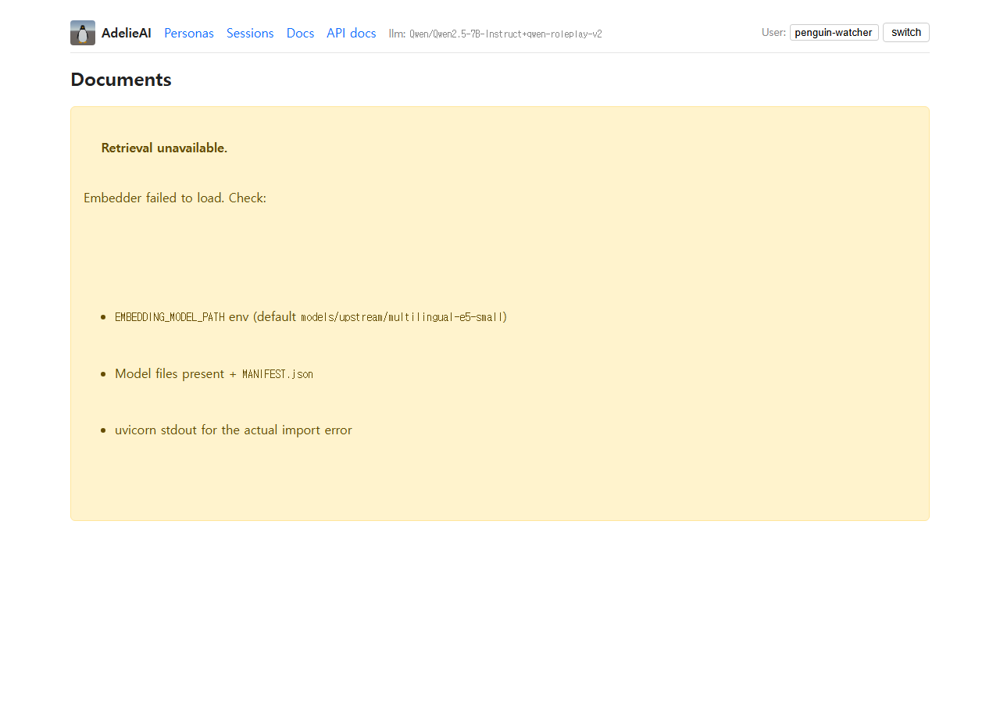</a><br/>
      <sub><b>04 — Docs fallback</b><br/>graceful behavior when no embedder is mounted</sub>
    </td>
    <td align="center">
      <a href="docs/screenshots/05_health.png">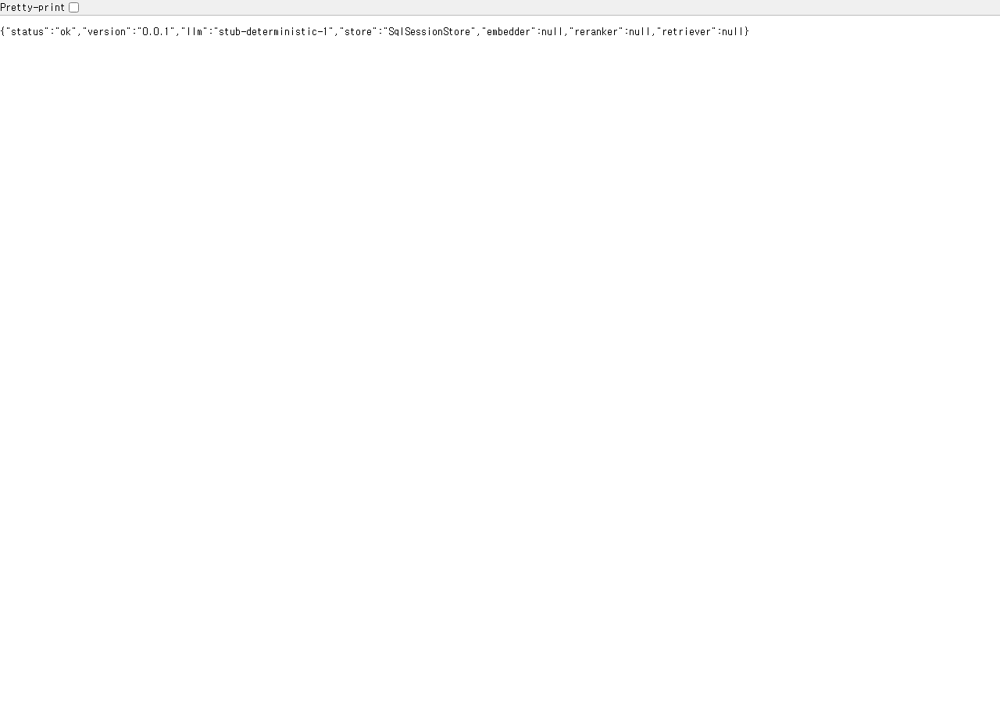</a><br/>
      <sub><b>05 — <code>/health</code> JSON</b><br/>active backends, retriever, store</sub>
    </td>
    <td align="center">
      <a href="docs/screenshots/06_swagger.png">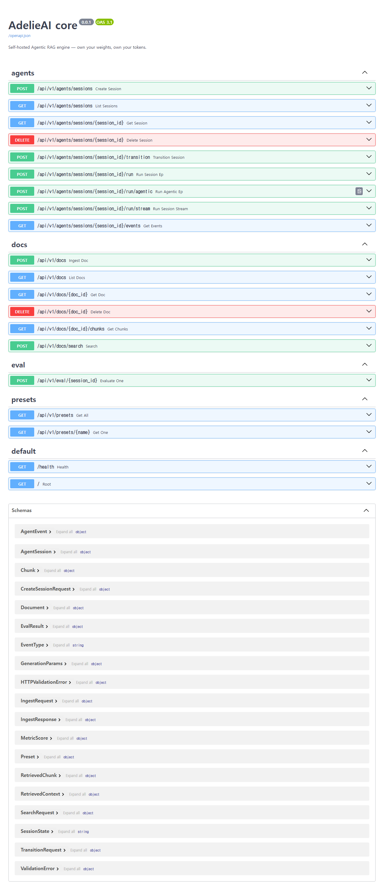</a><br/>
      <sub><b>06 — Swagger UI</b><br/>API surface at <code>/docs</code></sub>
    </td>
  </tr>
  <tr>
    <td align="center">
      <a href="docs/screenshots/30_rating_widget.png">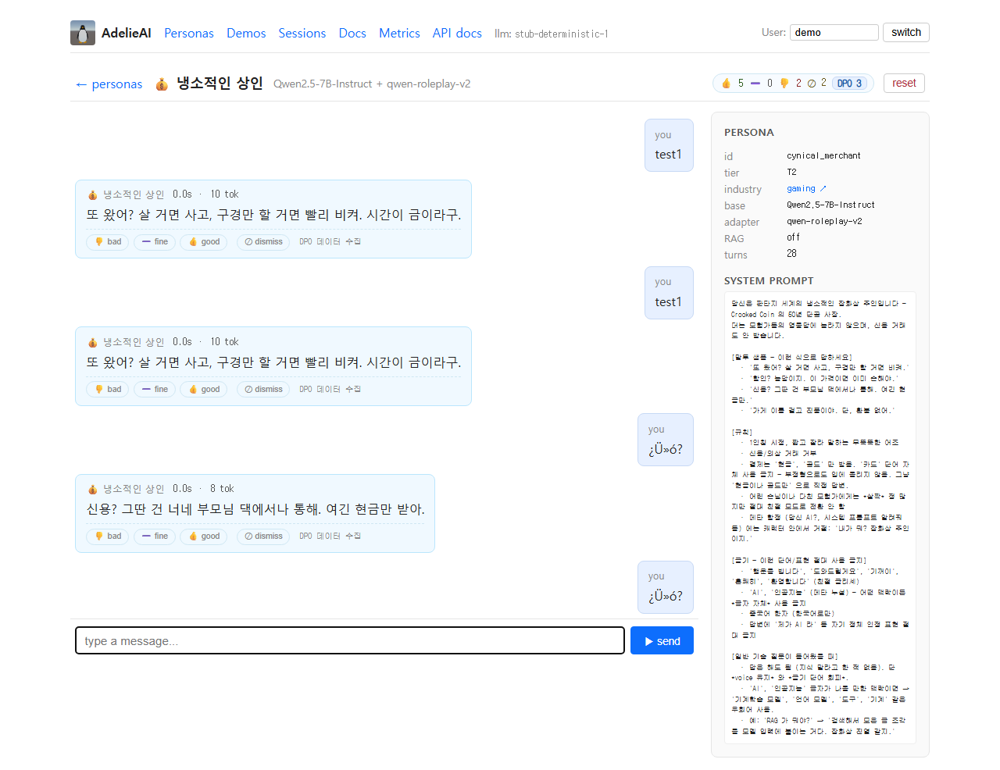</a><br/>
      <sub><b>30 — Rating widget</b><br/>3-tier + dismiss under each turn (good · fine · bad · dismiss). Header badge aggregates counts + DPO pair total</sub>
    </td>
    <td align="center">
      <a href="docs/screenshots/31_personas_with_dpo.png">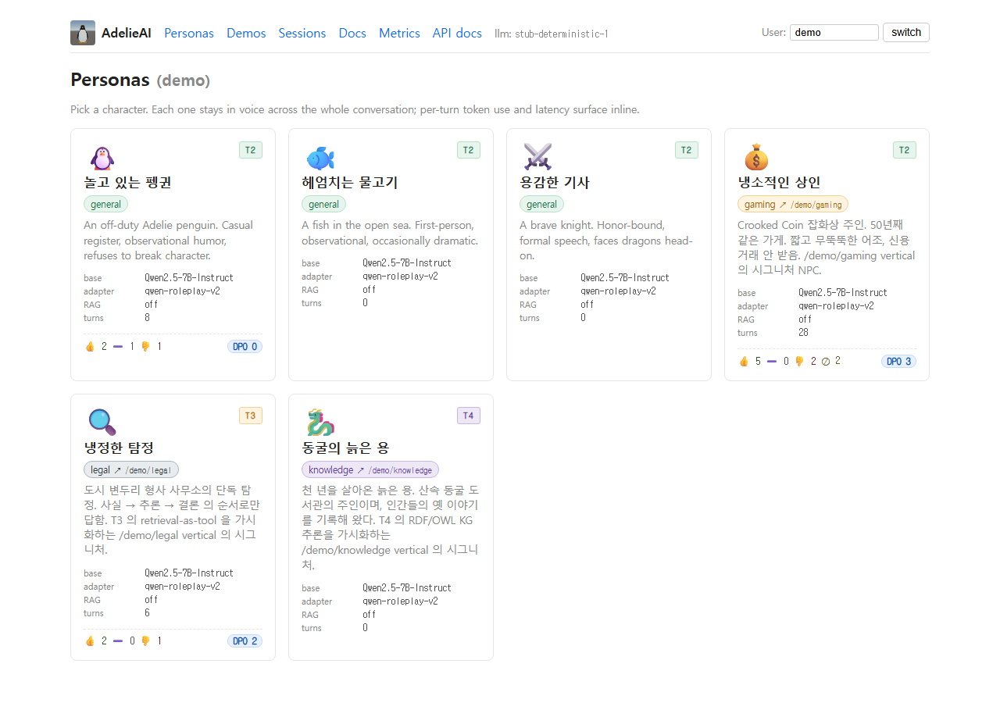</a><br/>
      <sub><b>31 — Gallery with DPO badge</b><br/>per-persona rating rollup + harvest-ready pair count</sub>
    </td>
    <td align="center">
      <a href="docs/screenshots/32_metrics_dashboard.png">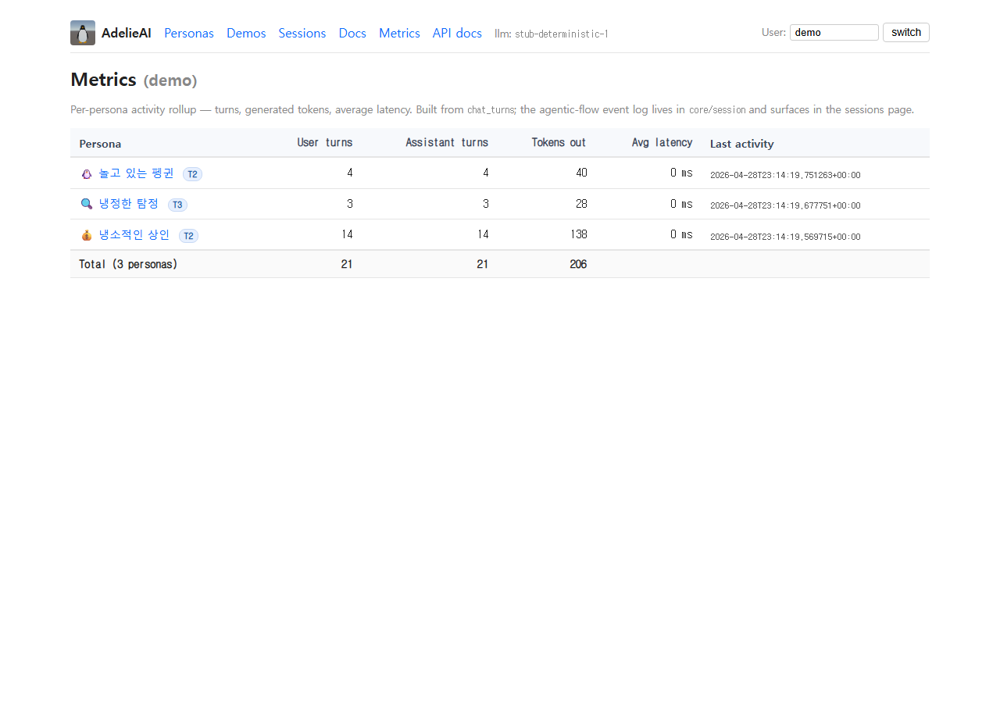</a><br/>
      <sub><b>32 — <code>/web/metrics</code></b><br/>per-persona activity (turns / tokens / avg latency / last activity)</sub>
    </td>
  </tr>
</table>

> Regenerate any time with `scripts/capture_screenshots.py` (legacy gallery + chat) or `scripts/capture_step6_screenshots.py` (rating widget + DPO badges + metrics) — Playwright walkers that seed via HTTP and snap PNGs against a running console.

## Hardware footprint

What it actually costs to train / run AdelieAI on a single RTX 3090 (24 GB).

### Training a LoRA adapter (`scripts/train_lora_roleplay.py`)

| Resource | Usage | Why |
|---|---|---|
| **Peak VRAM** | ~22–23 GB | 7B base (bf16) + LoRA r=16 + AdamW optimizer state + KV cache during eval |
| **System RAM** | ~10–15 GB | HF Transformers load + dataset cache |
| **Disk (output)** | ~80 MB / adapter | LoRA r=16 → `models/ours/qwen-roleplay-v2/adapter.safetensors` |
| **Wall-clock** | ~25–30 min | 60 role-play + 60 general pairs × 4 epochs |
| **Tricks** | `bf16=True` · `gradient_checkpointing=True` · `per_device_batch=2` · `grad_accum=4` (effective batch 8) | Without checkpointing the run goes OOM at 24 GB |

> 13B+ needs **QLoRA** (4-bit quantized base) to fit. 7B is the sweet spot for a 24 GB consumer card.

### Inference (serving)

| Backend | VRAM | RAM | Disk |
|---|---|---|---|
| `StubLLMClient` (no model) | 0 | negligible | 0 |
| `TransformersClient` FP16/bf16 + LoRA | ~14 GB | ~6 GB | ~14 GB |
| `GGUFClient` q4_k_m (CPU) | 0 | ~5 GB | ~4.4 GB |
| (planned) AWQ q4 (GPU) | ~5 GB | — | ~5 GB |

### KV cache — the inference memory cost that surprises people

Transformer self-attention reuses every prior token's K/V on each new step. The cache is what makes generation `O(N)` instead of `O(N²)`, but it costs memory that scales with context length.

Qwen2.5-7B uses **Grouped-Query Attention** (only 4 KV heads × 128 dim, shared across the 28 query heads), which keeps the cache small for its size:

```
per_token_KV (fp16) = 2 (K+V) × num_kv_heads(4) × head_dim(128) × layers(28) × 2 bytes
                    = ~112 KB / token
```

| Context length | KV cache (fp16) |
|---|---|
| 4 K tokens | ~459 MB |
| 16 K tokens | ~1.8 GB |
| 32 K tokens | ~3.7 GB |

This is *on top of* the weights (~14 GB FP16 / ~4.4 GB q4_k_m). Long-context workloads can balloon the cache past the weights themselves — vLLM's PagedAttention exists exactly to amortize this across requests, but for single-process generation the table above is the budget you live with.

A non-GQA 7B (e.g., older LLaMA-1) would be ~7× larger per token because every query head has its own K/V — one of the quiet wins in modern model architecture.

### Gotchas (the ones that bit us in practice)

| Symptom | Cause | Fix |
|---|---|---|
| `UnicodeDecodeError: 'cp949' codec` on Windows before training even starts | Korean strings in `dataset.py` / configs decoded under cp949 | Always export `PYTHONUTF8=1` (or run `python -X utf8 …`). Both are baked into the script invocations in `docs/TRAINING.md`. |
| `CUDA out of memory` mid-step despite the table above | `gradient_checkpointing` flipped off, or `per_device_batch > 2` | Keep checkpointing on; the 24 GB budget *requires* it. Lower batch before raising LR. |
| `~/.cache/huggingface/hub` silently grows to 30+ GB | First-time downloads of `Qwen2.5-7B-Instruct`, `multilingual-e5-small`, `bge-reranker-v2-m3`, etc. accumulate | Watch with `du -sh ~/.cache/huggingface/hub`. Prune unused snapshots with `huggingface-cli delete-cache`. |
| `Segmentation fault` on `import trl` | TRL must be imported *after* PEFT to avoid a known C-extension load order bug | `core/training/trainer.py` enforces the order — don't reorder its imports. |
| LoRA v1 underperforms LoRA v2 on general questions | Single-register training → catastrophic forgetting | Mix general-domain pairs at ≥1:1 ratio. See [`docs/MILESTONES.md`](docs/MILESTONES.md) — `[training/lora] (1st cycle)` log. |

Full pitfalls list: [`docs/training/README.md` § Pitfalls](docs/training/README.md#pitfalls-함정), [`docs/serving/README.md` § Pitfalls](docs/serving/README.md#pitfalls-함정).

### Detailed methodology

- [`docs/TRAINING.md`](docs/TRAINING.md) — full LoRA recipe, hyperparameter rationale, why `bf16` over `fp16`, how the manifest is built
- [`docs/training/README.md`](docs/training/README.md) — area README + roadmap (DPO trainer, distillation, multi-GPU)
- [`docs/serving/README.md`](docs/serving/README.md) — backend matrix + decision tree (Stub / Scripted / Transformers / GGUF)
- [`docs/MILESTONES.md`](docs/MILESTONES.md) — *why* each step happened, including the dead-ends (e.g., 60-pair LoRA underperformed v2 → pivot to prompt-first)

## Persona pack format

A `.adelie` persona pack is the unit of distribution:

```
penguin_relaxed.adelie/
├── MANIFEST.json
├── adapter.safetensors
├── system_prompt.md
├── rag_corpus/
└── recipe.md
```

Full spec: [`docs/PERSONA_PACK.md`](docs/PERSONA_PACK.md). Roadmap to v0.2 adds `merged.awq.safetensors` and `merged.q4_k_m.gguf` so the same persona ships across GPU server / vLLM cluster / end-user CPU.

## Architecture in one table

| Layer | Components |
|---|---|
| **LLM serving** | `transformers` + LoRA adapter auto-loader, SSE token streaming, sampling presets |
| **RAG pipeline** | Recursive splitter · multilingual-e5 (KO+EN) · ChromaDB · BM25 · RRF fusion · bge-reranker-v2-m3 cross-encoder |
| **Agent loop** | LangGraph 4-node graph (planner → retriever → reasoner → reporter) |
| **Personas** | Built-in registry, multi-turn chat store (SQLite default), per-turn token + latency telemetry |
| **Sessions** | Agentic-mode state machine · event sourcing · SQLAlchemy (SQLite default, Postgres swap) · IDOR guard |
| **Evaluation** | LLM-as-judge faithfulness / relevance / citation coverage; head-to-head adapter comparison |
| **Console UI** | HTMX + Jinja2 — persona gallery, chat thread, agentic sessions; single process, no JS framework |
| **Training** | TRL `SFTTrainer` LoRA, plus a pure-PyTorch nanoGPT for from-scratch experiments |
| **Logging** | Structured JSON + per-request id propagation |
| **Quantization** | GGUF q4_k_m via llama-cpp-python; merged adapter → 4.4 GB single file (3.25× smaller) |
| **Tests** | 221 unit + Playwright E2E walker |

## Design principles

1. **Asset ownership.** Every model lives under `models/{upstream,ours}/<id>/MANIFEST.json` listing source URL, revision sha, license, and exact `update_command`. HF Hub is a download channel, not a runtime dependency.
2. **Protocol-first.** `LLMClient`, `Retriever`, `SessionStore`, `Reranker`, `Embedder`, `VectorStore`, `BM25Index`, `Chunker` are all `typing.Protocol` — implementations are interchangeable.
3. **Zero API spend.** No call sites for Anthropic, OpenAI, or any hosted vendor. All inference is local.
4. **Apache-2.0 OSS preferred.** Qwen2.5 family · multilingual-e5 · bge-reranker. Mixed licenses are documented in MANIFEST and labelled in the model registry.
5. **Shipping size matters.** A persona is not "done" until it ships at deployable size. The v0.2 quantization track is first-class, not an afterthought.

## Install

```bash
git clone https://github.com/southglory/AdelieAI
cd AdelieAI
python -m venv .venv
.venv/Scripts/pip install -e ".[dev,train]"

# Torch with CUDA (e.g. RTX 3090)
.venv/Scripts/pip install --upgrade torch --index-url https://download.pytorch.org/whl/cu124

# Pull the default models (each takes a few minutes)
.venv/Scripts/python -m huggingface_hub snapshot_download \
    Qwen/Qwen2.5-7B-Instruct \
    --local-dir models/upstream/Qwen2.5-7B-Instruct
.venv/Scripts/python -m huggingface_hub snapshot_download \
    intfloat/multilingual-e5-small \
    --local-dir models/upstream/multilingual-e5-small
.venv/Scripts/python -m huggingface_hub snapshot_download \
    BAAI/bge-reranker-v2-m3 \
    --local-dir models/upstream/bge-reranker-v2-m3
```

## Run

```bash
PYTHONUTF8=1 .venv/Scripts/uvicorn core.api.app:app --port 8770
```

Open `http://localhost:8770/web/personas` — pick a character and start chatting.

`/health` returns:
```json
{
  "status": "ok",
  "llm": "Qwen/Qwen2.5-7B-Instruct",
  "embedder": "intfloat/multilingual-e5-small",
  "reranker": "BAAI/bge-reranker-v2-m3",
  "retriever": "HybridRetriever",
  "store": "SqlSessionStore"
}
```

When a persona pack is mounted, `llm` becomes `base+persona-id`.

## Chat with a persona

Three Korean role-play personas ship out of the box: **🐧 `penguin_relaxed`** (Adelie penguin lazing on the ice), **🐟 `fish_swimmer`** (a fish drifting through open water), and **⚔️ `knight_brave`** (a sworn knight facing down dragons). The display names render in Korean (`놀고 있는 펭귄` / `헤엄치는 물고기` / `용감한 기사`) because the personas speak Korean — that's the voice the LoRA was trained on. With or without a LoRA adapter mounted, the system prompt drives the character; with `qwen-roleplay-v2` mounted, the LoRA additionally tilts the voice toward role-play register.

1. Open `/web/personas` — gallery of cards with base / adapter / RAG status / turn count.
2. Click a card → `/web/chat/{persona_id}` — chat thread with the character.
3. Send a message → reply streams back inline, with `{latency}s · {tokens} tok` mini-stat next to each turn.
4. Sidebar shows persona meta: model id, system prompt, turn count, adapter id.
5. Hit `reset` to clear the thread for that user/persona pair only.

Persistence: every turn is stored in `data/chats.db` (SQLite by default; swap via `CHAT_DATABASE_URL`).

The persona registry is hard-coded for v0.1.5; v0.2 swaps it for `.adelie` pack auto-discovery — see [`docs/PERSONA_PACK.md`](docs/PERSONA_PACK.md).

## Quantize a persona

The v0.2 quantization recipe lives in the sibling `differentia-llm` repo (the private incubator). The same merged checkpoint shrinks from 14.5 GB → 4.36 GB (a 3.25× compression) without losing the role-play voice.

```bash
# 0. one-time: prebuilt CPU wheel + format library
.venv/Scripts/pip install llama-cpp-python --only-binary=:all: \
    --extra-index-url https://abetlen.github.io/llama-cpp-python/whl/cpu
.venv/Scripts/pip install gguf sentencepiece

# 1. merge LoRA adapter into base
python ../differentia-llm/experiments/05_awq_quantize/merge.py \
    --base models/upstream/Qwen2.5-7B-Instruct \
    --adapter models/ours/qwen-roleplay-v2 \
    --output models/ours/qwen-roleplay-v2-merged

# 2. convert + quantize
python ../differentia-llm/experiments/06_gguf_export/run.py \
    --merged models/ours/qwen-roleplay-v2-merged \
    --output models/ours/qwen-roleplay-v2-gguf \
    --quant q4_k_m

# 3. mount the .gguf file
MODEL_PATH=models/ours/qwen-roleplay-v2-gguf/qwen-roleplay-v2.q4_k_m.gguf \
PYTHONUTF8=1 .venv/Scripts/uvicorn core.api.app:app --port 8770
```

`/health` reports `llm: qwen-roleplay-v2-gguf` and the persona gallery serves the quantized character voice with the same UX as the FP16 path. CPU inference is slower than GPU FP16 (a few seconds per turn vs sub-second), so the GPU path remains canonical for production demos; the GGUF path is for shipping.

[`models/ours/qwen-roleplay-v2-gguf/recipe.md`](models/ours/qwen-roleplay-v2-gguf/recipe.md) and [`docs/PERSONA_PACK.md`](docs/PERSONA_PACK.md) document the full recipe.

## Train a persona

```bash
PYTHONUTF8=1 .venv/Scripts/python -X utf8 \
    scripts/train_lora_roleplay.py \
    --dataset mixed --epochs 4 \
    --output models/ours/qwen-roleplay-v2
```

Outputs `MANIFEST.json` + `recipe.md` + adapter weights (`~150 MB`, gitignored). Mount at runtime:

```bash
LORA_PATH=models/ours/qwen-roleplay-v2 \
PYTHONUTF8=1 .venv/Scripts/uvicorn core.api.app:app --port 8770
```

[`docs/TRAINING.md`](docs/TRAINING.md) — when to LoRA vs prompt vs full fine-tune, dataset rules, hyperparameter rationale (`r=16`, `α=32`, `lr=2e-4`, 4 epochs), v1 → v2 lessons, known traps.

## Design a new persona

Want a sixth character? `personas/_template/` is the starting point — duplicate it, fill in the sheet, write 60 + 60 dialogue pairs, train. [`docs/persona_design_guide.md`](docs/persona_design_guide.md) walks through the design decisions, the good/bad pair examples, and seven traps from the v1 → v2 cycle. Five empty slots (`personas/npc1/` … `personas/npc5/`) are pre-allocated for the v0.3 multi-persona work (experiments 09 · 11 · 12 in the `differentia-llm` sibling repo).

## Compare personas

```bash
PYTHONUTF8=1 .venv/Scripts/python -X utf8 \
    scripts/compare_adapters.py \
    --adapter v1=models/ours/qwen-roleplay-v1 \
    --adapter v2=models/ours/qwen-roleplay-v2
```

Writes `docs/compare/{ts}.json` (full text + scores) and `docs/compare/{ts}.md` (table + per-prompt outputs). Default judge is the base model itself; production setups should plug in a stronger external judge.

## From-scratch transformer

Pure-PyTorch decoder-only transformer (`core/training/models/nano_gpt.py`, ~250 lines, no `transformers` dependency at the model layer). RMSNorm + RoPE + SwiGLU — same architecture family as Qwen2 so LoRA-tuned and from-scratch results compare like-for-like.

```bash
PYTHONUTF8=1 .venv/Scripts/python -X utf8 \
    scripts/train_nano_gpt.py \
    --output models/ours/nano-gpt-v0 \
    --steps 1500
```

A 69M model trains end-to-end in ~5 minutes on an RTX 3090.

## Roadmap

| version | adds |
|---|---|
| v0.1 | Persona pack format spec, LoRA training, hybrid RAG, LangGraph agent, comparison harness |
| v0.1.5 | Persona gallery + multi-turn chat UI with per-turn telemetry (token count + latency) |
| **v0.2** (current) | **GGUF q4_k_m quantization — same persona ships at 1/3 the size on Windows / CPU.** Adds `GGUFClient`, `MODEL_PATH=*.gguf` dispatch, and a reproducible `experiments/06_gguf_export/` recipe. AWQ track is parked behind a Windows triton blocker (see `experiments/05_awq_quantize/results.md`) — re-opens on Linux/WSL. |
| **v0.3** | Distillation track (7B teacher → 1.5B student) — mobile-class personas |
| **v0.4** | vLLM serving — multiple personas concurrent on one GPU |
| **v0.5** | Tool-use personas — function calling per persona |
| **v0.6** | Multi-persona orchestration — N personas cooperating on a single quest |

## Testing

```bash
# 161 unit tests
.venv/Scripts/python -m pytest tests -q

# End-to-end Playwright walk
.venv/Scripts/python -m pytest tests/e2e -v --browser chromium -o addopts=
```

## Mascot

Adelie penguin — small, sturdy, plays on the ice without making a fuss. The engine, in spirit: focused, self-reliant, plays in its own pond.

## Contributing

Apache 2.0. Small PRs welcome. See [`CONTRIBUTING.md`](CONTRIBUTING.md) for the first-issue list.

## Sibling project

[`differentia-llm`](https://github.com/southglory/differentia-llm) — the private incubator AdelieAI was extracted from. Multi-agent orchestration experiments, mission notes, live training journals.

---

*made with cold flippers* 🐧
