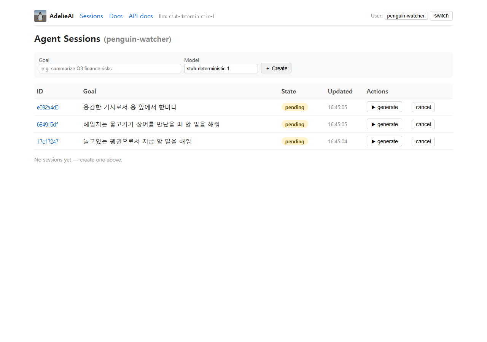

<div align="center">
  

# AdelieAI

**Self-hosted Agentic RAG engine — own your weights, own your tokens.**

[](LICENSE)
[](https://www.python.org/downloads/)
[](#testing)

</div>

---

## Why

A complete LLM stack — base model, embedder, reranker, agent loop, evaluation, training — that runs on a single GPU and never calls a third-party API. You own the weights. You own the tokens. Production-grade pieces, no vendor lock-in.

## What's inside

| Layer | Components |
|---|---|
| **LLM serving** | `transformers` + LoRA adapter auto-loader, SSE token streaming, sampling presets |
| **RAG pipeline** | Recursive splitter · multilingual-e5 (KO+EN) · ChromaDB · BM25 · RRF fusion · bge-reranker-v2-m3 cross-encoder |
| **Agent loop** | LangGraph 4-node graph (planner → retriever → reasoner → reporter) |
| **Sessions** | Pydantic state machine · event sourcing · SQLAlchemy (SQLite default, Postgres swap) · IDOR guard |
| **Evaluation** | LLM-as-judge faithfulness · answer-relevance · citation-coverage; head-to-head adapter comparison harness |
| **Console UI** | HTMX + Jinja2 — single process, no JS framework |
| **Training** | TRL `SFTTrainer` LoRA, plus a pure-PyTorch nanoGPT implementation for from-scratch experiments |
| **Logging** | Structured JSON + per-request id propagation |
| **Tests** | 147 unit + Playwright E2E walker |

## Live console



The session list runs Korean role-play prompts (penguin / fish / knight) on the same state machine. Top-left penguin mascot, top-right `llm:` label shows the active model id (here `stub-deterministic-1` — fallback when no real weights are mounted; with weights it reads `Qwen/Qwen2.5-7B-Instruct` or `Qwen/Qwen2.5-7B-Instruct+qwen-roleplay-v2`).

| Frame | What it shows |
|---|---|
| [`01_sessions.png`](docs/screenshots/01_sessions.png) | Sessions list, hero shot |
| [`02_run_config.png`](docs/screenshots/02_run_config.png) | Per-session run config form (sampling params · `retrieval_k`) |
| [`03_answer.png`](docs/screenshots/03_answer.png) | After generate — answer card + token strip |
| [`04_docs_unavailable.png`](docs/screenshots/04_docs_unavailable.png) | Graceful 503 page when no embedder is mounted |
| [`05_health.png`](docs/screenshots/05_health.png) | `/health` JSON output |
| [`06_swagger.png`](docs/screenshots/06_swagger.png) | Auto-generated Swagger at `/docs` |

> Regenerate any time with `scripts/capture_screenshots.py` — a Playwright Chromium walker that drives the running console with no assertions, just captures.

## Design principles

1. **Asset ownership (provenance).** Every model lives under `models/{upstream,ours}/<id>/MANIFEST.json` listing source URL, revision sha, license, and the exact `update_command` used. HF Hub is a download channel, not a runtime dependency.
2. **Protocol-first.** `LLMClient`, `Retriever`, `SessionStore`, `Reranker`, `Embedder`, `VectorStore`, `BM25Index`, `Chunker` are all `typing.Protocol`. Implementations are interchangeable — `InMemorySessionStore` ↔ `SqlSessionStore`, `StubLLMClient` ↔ `TransformersClient`, `DenseRetriever` ↔ `HybridRetriever`.
3. **Zero API spend.** No call sites for Anthropic, OpenAI, or any hosted vendor. All inference is local.
4. **OSS first.** Apache-2.0 base models preferred (Qwen2.5 7B / 14B / 32B / 72B, multilingual-e5, bge-reranker). Mixed licenses (e.g. Qwen2.5-3B Research) are documented in MANIFEST and labelled in the model registry.

## Install

```bash
git clone https://github.com/<you>/AdelieAI
cd AdelieAI
python -m venv .venv
.venv/Scripts/pip install -e ".[dev,train]"

# Torch with CUDA (e.g. RTX 3090)
.venv/Scripts/pip install --upgrade torch --index-url https://download.pytorch.org/whl/cu124

# Pull the default models (each takes a few minutes)
.venv/Scripts/python -m huggingface_hub snapshot_download \
    Qwen/Qwen2.5-7B-Instruct \
    --local-dir models/upstream/Qwen2.5-7B-Instruct
.venv/Scripts/python -m huggingface_hub snapshot_download \
    intfloat/multilingual-e5-small \
    --local-dir models/upstream/multilingual-e5-small
.venv/Scripts/python -m huggingface_hub snapshot_download \
    BAAI/bge-reranker-v2-m3 \
    --local-dir models/upstream/bge-reranker-v2-m3
```

## Run

```bash
PYTHONUTF8=1 .venv/Scripts/uvicorn core.api.app:app --port 8770
```

Open `http://localhost:8770/web/` in a browser.

`/health` returns:
```json
{
  "status": "ok",
  "llm": "Qwen/Qwen2.5-7B-Instruct",
  "embedder": "intfloat/multilingual-e5-small",
  "reranker": "BAAI/bge-reranker-v2-m3",
  "retriever": "HybridRetriever",
  "store": "SqlSessionStore"
}
```

## End-to-end walkthrough

[`docs/USAGE.md`](docs/USAGE.md) — twelve-step guided tour from session creation through document ingest, hybrid search, streaming generation, the events timeline, and the evaluation pane. Includes a curl cheatsheet for every endpoint.

## Fine-tuning

LoRA on Qwen2.5-7B in ~80 seconds on a single 3090:

```bash
PYTHONUTF8=1 .venv/Scripts/python -X utf8 \
    scripts/train_lora_roleplay.py \
    --dataset mixed --epochs 4 \
    --output models/ours/qwen-roleplay-v2
```

Outputs `MANIFEST.json` + `recipe.md` (auto) + the adapter weights (`~150 MB`, gitignored). Mount it at runtime:

```bash
LORA_PATH=models/ours/qwen-roleplay-v2 \
PYTHONUTF8=1 .venv/Scripts/uvicorn core.api.app:app --port 8770
```

`/health.llm` becomes `Qwen/Qwen2.5-7B-Instruct+qwen-roleplay-v2`, so audit events on every generated session record the exact base + adapter combination.

[`docs/TRAINING.md`](docs/TRAINING.md) explains *why* — when to LoRA vs prompt vs full fine-tune, dataset design rules, hyperparameter rationale (`r=16`, `α=32`, `lr=2e-4`, 4 epochs), the v1 → v2 lesson on register mixing, and known Windows traps.

## From-scratch transformer

For learning, the repository ships a pure-PyTorch decoder-only transformer (`core/training/models/nano_gpt.py`, ~250 lines, no `transformers` dependency at the model layer). RMSNorm + RoPE + SwiGLU — same architecture family as Qwen2 so LoRA-tuned and from-scratch results compare like-for-like.

```bash
PYTHONUTF8=1 .venv/Scripts/python -X utf8 \
    scripts/train_nano_gpt.py \
    --output models/ours/nano-gpt-v0 \
    --steps 1500
```

A 69M-parameter model trains end-to-end (1500 steps × batch 16 × 384 ctx ≈ 9.2M tokens) in roughly 5 minutes on an RTX 3090.

## Adapter comparison

```bash
PYTHONUTF8=1 .venv/Scripts/python -X utf8 \
    scripts/compare_adapters.py \
    --adapter v1=models/ours/qwen-roleplay-v1 \
    --adapter v2=models/ours/qwen-roleplay-v2
```

Runs every prompt against every candidate, optionally scoring with an LLM-as-judge. Writes `docs/compare/{ts}.json` (full text + scores) and `docs/compare/{ts}.md` (human-readable table + per-prompt outputs). Default judge is the base model itself; production setups should plug in a stronger external judge.

## Testing

```bash
# 147 unit tests
.venv/Scripts/python -m pytest tests -q

# End-to-end Playwright walk
.venv/Scripts/python -m pytest tests/e2e -v --browser chromium -o addopts=

# Drive a live server (e.g. with real Qwen-7B loaded) instead of spawning one
E2E_BASE_URL=http://localhost:8770 .venv/Scripts/python -m pytest tests/e2e -v \
    --browser chromium -o addopts=
```

## Mascot

Adelie penguin — small, sturdy, plays on the ice without making a fuss. The engine, in spirit: focused, self-reliant, plays in its own pond.

## Contributing

Apache 2.0. Small PRs welcome. See [`CONTRIBUTING.md`](CONTRIBUTING.md) for the first-issue list (dataset diversification, multilingual reranker comparisons, AMD ROCm support, etc.).

## Sibling project

[`differentia-llm`](https://github.com/southglory/differentia-llm) — the private incubator AdelieAI was extracted from. Multi-agent orchestration experiments, mission notes, live training journals.

---

*made with cold flippers* 🐧
